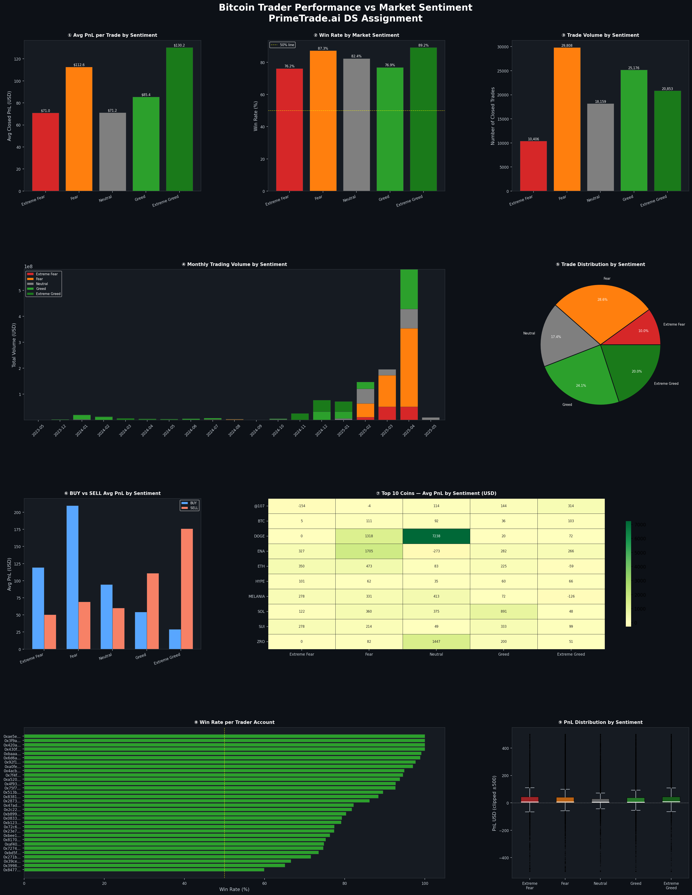

# Bitcoin Trader Performance vs Market Sentiment
### PrimeTrade.ai — Data Science Assignment

---

## 📌 Objective

Explore the relationship between **Bitcoin market sentiment** (Fear & Greed Index) and **trader performance** using real on-chain trading data from Hyperliquid. The goal is to uncover hidden patterns and deliver insights that can drive smarter trading strategies.

---

## 📂 Datasets Used

| Dataset | Description |
|---|---|
| `fear_greed_index.csv` | Daily Bitcoin Fear & Greed Index (2018–2025) with value (0–100) and classification |
| `historical_data.csv` | 211,000+ trade records from Hyperliquid including account, coin, PnL, leverage, side |

---

## 🔍 Key Findings

- **Extreme Greed** → Highest avg PnL ($130/trade) and win rate (89%) — momentum strategies thrive
- **Fear** → Second best performance ($112/trade, 87% win rate) — contrarian buying is profitable
- **Neutral** → Weakest returns ($71/trade, 82% win rate) — unclear market direction hurts performance
- **Extreme Fear** → Fewest trades (10K) — traders reduce activity during market panic
- **BUY side** consistently outperforms SELL across all sentiment categories

---

## 📊 Dashboard Preview



---

## 🛠️ Tools & Libraries

- **Python 3**
- **pandas** — data loading and manipulation
- **matplotlib** — charting and visualization
- **seaborn** — statistical heatmaps
- **numpy** — numerical operations
- **Jupyter Notebook** — interactive analysis environment

---

## 📁 Project Structure

```
├── DS_Assignment_Notebook.ipynb   # Full analysis code (step-by-step)
├── DS_Assignment_Report.docx      # Written report with insights & recommendations
├── analysis_dashboard.png         # 9-chart visual dashboard
└── README.md                      # Project overview (this file)
```

---

## 🚀 How to Run the Notebook

1. Install dependencies:
   ```bash
   pip install pandas matplotlib seaborn numpy
   ```
2. Open the notebook:
   ```bash
   jupyter notebook DS_Assignment_Notebook.ipynb
   ```
3. Place `fear_greed_index.csv` and `historical_data.csv` in the same folder
4. Run all cells top to bottom

---

## 💡 Strategy Recommendations

| Sentiment | Recommended Action |
|---|---|
| Extreme Greed | Increase position size — ride the momentum |
| Greed | Stay long with moderate sizing |
| Neutral | Reduce exposure — market lacks direction |
| Fear | Consider contrarian BUY opportunities |
| Extreme Fear | Minimal exposure, watch for reversal signals |

---

*Submitted to PrimeTrade.ai Hiring Team — April 2026*
